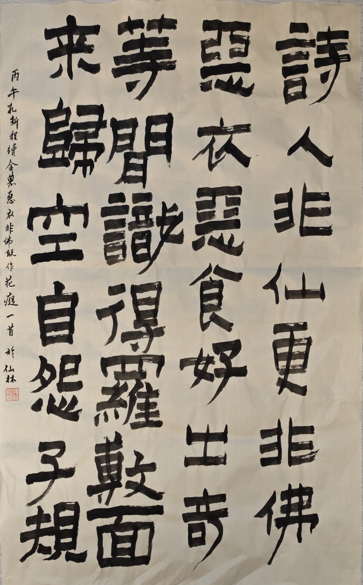

金农有「恶衣恶食诗更好，非佛非仙人出奇」之联，用笔奇怪，盖美术字也。是日杜鹃丛绽，归寝途中逢王诗林。诗林者，吾素喜之南大哲学系一姝丽也。无由会晤，且夫名花有主，难以为念，奈何奈何。间有不得不发，遂游戏文字，狗尾续貂，成花痴一篇。并自观摩金农笔意，试书其文。典出陌上桑，且寓花于子规之名，亦有巧思。区区自嘲也矣。

  

 

花痴
  
 

诗人非仙更非佛，

恶衣恶食好出奇。

等闲识得罗敷面，

来归空自怨子规。

