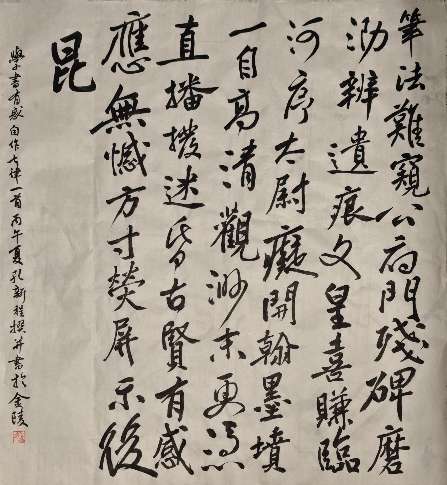

余学书不满载，进步不谓微，何者？不特坐拥百家法帖，亦由网络得而观高手笔势也。古之人虽得晋唐真迹，唯朱门深宫者可矣。余下刻帖辗转，以讹传讹。非名师口传身授，鲜得其门而入。夫天纵奇才其自学自悟自成者也。盖叹吾生也得其时，虽言网络时代书法衰微，古法岂不易得也欤？

 

学书有感
  
 

笔法难窥公府门，残碑磨泐辨遗痕。

文皇喜赚临河序，太尉痴开翰墨坟。

<<<<<<< HEAD

一自高清观渺末，更凭直播拨长灯。

古贤有感应无憾，方寸荧屏示后昆。

 

  

 
又：五月十六日书。按照赵博的意思，在行书中穿插草书。楷书是静态节奏，行书稍有动态，草书完全是动态。穿插在一起，就有节奏感，否则容易单字好看，但整体不贯气。然而我既不会草法，也没有结字能力，所以目前为止所有的作品都是通过经营，集字设计的，所以自然之感是欠缺的。再加上大字线条质量也一般，所以其实创作的水准是比较差劲的。书写能力不像认知可能有突飞猛进的变化，只能慢慢打磨。好在我的内容可以是自己的，很多写毛笔字的人反而做不到（不能高估他们的文化水平）。再有就是，其实大美汉字作品展里，业余选手大部分也写得跟蛆一样，很多手腕都僵住不能动，只好写点单薄的隶书装装样子，我已经比他们强得多了。赵博，子云，周博也都评价这件是好的。
=======

一自高清观渺末，更凭直播拨迷昏。

古贤有感应无憾，方寸荧屏示后昆。

>>>>>>> 1b4b2d9f0dc48f71224deb7c4053e50662f5f327
